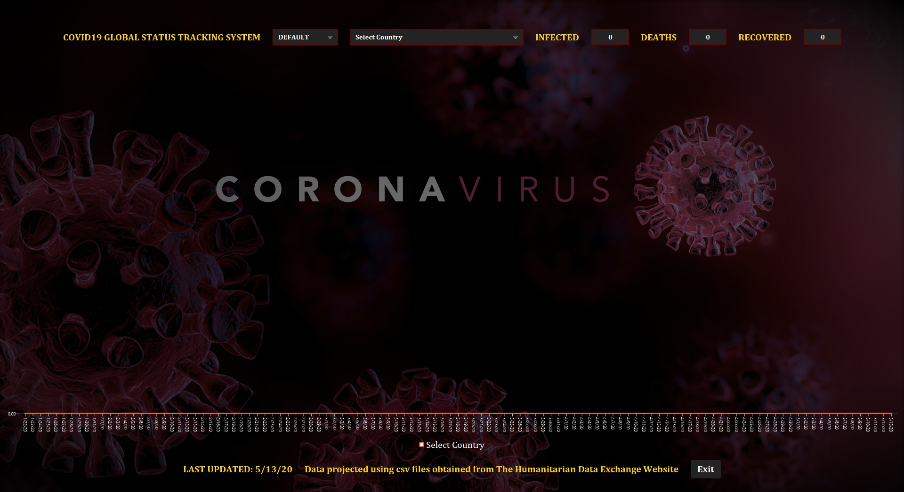
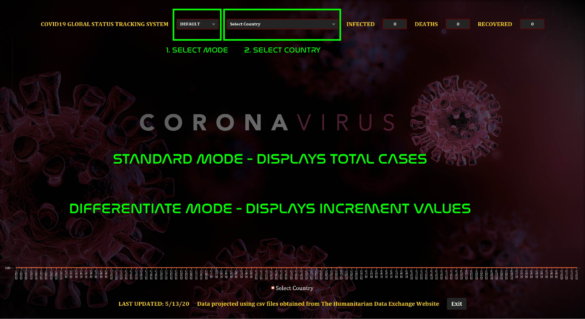
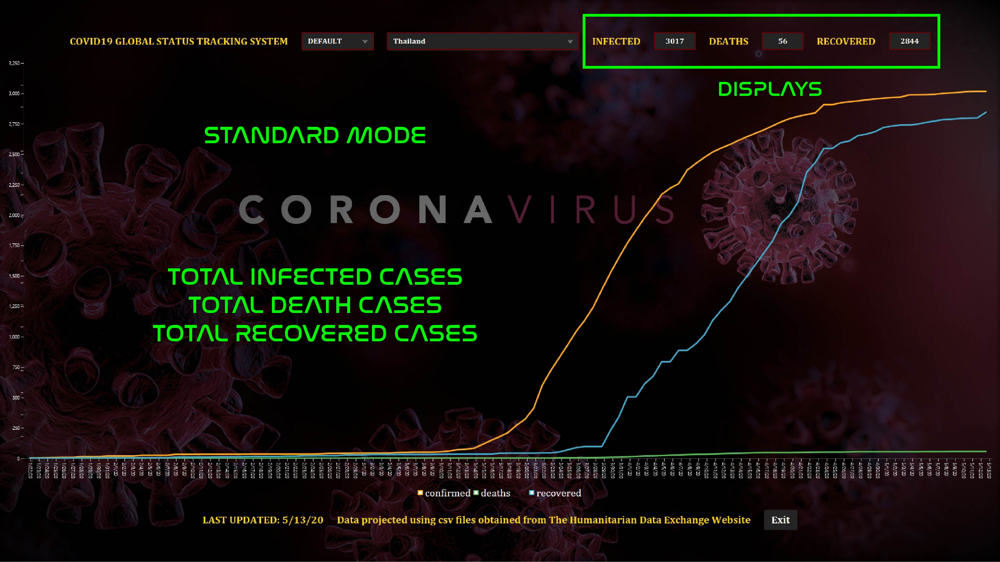
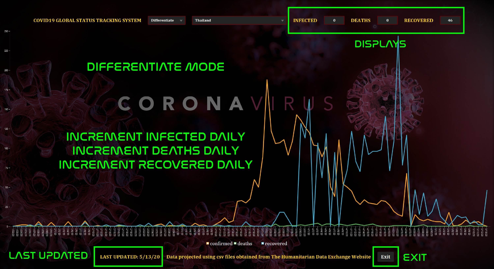

<p align = "center">
    
</p>

**COVID19 GLOBAL STATUS TRACKING SYSTEM** is an application tracking COVID19 current statuses of total infected cases, total death cases and total recovered cases with up-to-date data tracking from online sources.

| Mode            | Status                            | Description |
| :----------------- | :-------------------------------- | :------------------ |
| Standard           | Original Edition               | Displays total cases               |
| Differential       | DLC                            | Displays differentiate values each day|

<!-- [](tracker/images/firstShot.jpg) -->

* [Requirements](#requirements)
* [Features](#features)
<!-- * [Installing](#installing) -->
* [Configuration](#configuration)
* [How-to-use](#how-to-use)
* [JAR](#jar)
* [References](#references)

## Requirements

* JAVA (Any version, Java 11.0.5 used to create this application);

* JAVAFX (Any version, Javafx 11.0.2 used to create this application);

* opencsv (Used to read CSV files, version 3.8 was used);

## Features

* Download csv files from online sources;

* Validate file's date to see if the download is necessary;

* Read csv files by sepate each cells via opencsv;

* Transform number format data into visual data using Line Chart;

* Customized theme included using stylesheet written in css;

* Simple design to prevents any confusion while using the application.

<!-- ## Installing

* Change directory to the project's destination:

```bash
cd project-path
```

* Add javafx modules and opencsv to the applcation: -->

## Configuration

Adds javafx & opencsv to JAVA Dependencies:

VSCODE - Adds vmArgs line to include javafx module:

```yml
  "type": "java",
  "name": "Debug (Launch)-Tracker<pa4-VonKiar_e716242b>",
  "request": "launch",
  "mainClass": "Tracker",
  "vmArgs": "--module-path javafx-path/javafx-sdk-11.0.2/lib --add-modules javafx.controls,javafx.fxml",
  "projectName": "pa4-VonKiar_e716242b"
```

## How-To-Use

[](tracker/images/htu1.jpg)

[](tracker/images/htu2.jpg)

[](tracker/images/htu3.jpg)

## JAR

```bash
  After having meeting with Jim:
    This project does not need to have JAR file;
    Part of codes may be same as Sahanon P.;
```


## References

The Humanitarian Data Exchange (2020, April 27). [Covid19 csv data](https://data.humdata.org/dataset/novel-coronavirus-2019-ncov-cases). Retrieved from https://data.humdata.org/dataset/novel-coronavirus-2019-ncov-cases

Oracle (2014, January). [Javafx chart example](https://docs.oracle.com/javafx/2/charts/line-chart.htm#CIHGBCFI). Retrieved from https://docs.oracle.com/javafx/2/charts/line-chart.htm#CIHGBCFI.